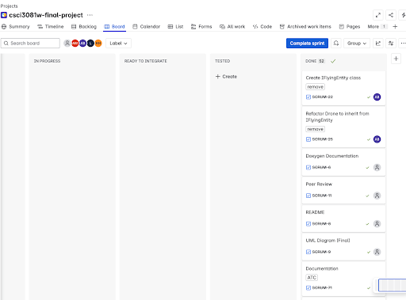
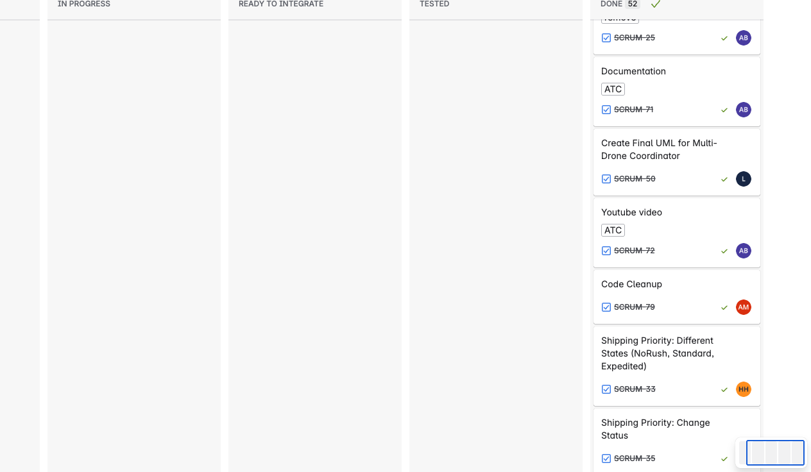
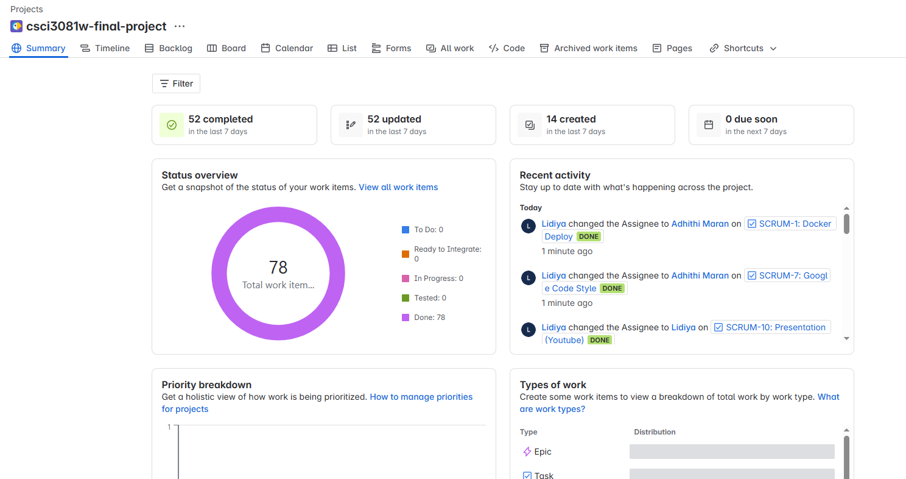

# Drone Simulation Project - Team 001-41

## Team Members:
- maran060: Adhithi Maran
- hassa559: Hamza Hassan
- derg0004: Lidiya Dergacheva
- banin010: Adam Banini

## Overview:
The drone simulation project models package delivery across the University of Minnesota Twin Cities campus. The end user schedules deliveries by selecting the pickup and drop-off locations, naming the package for delivery, and choosing its path delivery strategy. The base system also supports human and helicopter entities and simulates their behaviors.

Several extensions are created to expand on the system's base capabilities. Specialized drone types of LeaderDrone and HelperDrone are created for a more efficient delivery network. Leader drones handle primary deliveries and are supported by helper drones when their battery reaches critical levels. While leader drones monitor their battery states and adjust their behavior accordingly, helper drones operate without the battery component and can seamlessly take over package deliveries when needed. Leader drones track their charging station location and travel to the charging station as needed. The charging station entity is created to simulate the charging station and has a visual representation in the system.

Safety and efficiency are further improved through an air traffic control system that prevents mid-air collisions by managing the routes of all flying entities. This includes drones, helicopters, and the newly added airplanes. The controller continuously monitors the flight paths of all flying entities. By using linear algebra(dot products), it calculates whether flight paths are intersecting. Then the controller calculates how long until the collision occurs based on speed. If the controller sees a collision that will happen in the near future it reroutes the flying entities.

Package management is enhanced with a priority queue system that organizes deliveries based on urgency levels. Users can adjust package priorities between standard, no rush, and expedited status before pickup. Leader drones dynamically respond to these priority changes, reordering their pickup sequences to accommodate the updated delivery schedule. The front end is augmented to display the changing package queue to the end user.

Finally, a data collection manager provides comprehensive analysis and debugging capabilities by generating a detailed report on all system activities and essential feature activity. The class allows for any entity to log metrics and enhances the simulation's ability to analyze and debug. The data collection manager is integrated with the frontend and allows users to click and export all logging data to a .csv file located in the project root directory.

The extensions enhance the original base code of the drone simulation for a more realistic representation.
## Instructions:

1. Build & Run: make clean; make -j; make run
2. Front End: 
    1. Data Collection Manager: Click on "Send Stats to CSV" Button to export log into project root folder. The name will be EntityLog_UnixEpoch#.csv. 
    2. Standard Shipping: After naming your package, click the drop down menu to select your preferred priority. Also, if you wish to change priority of a package click on the "Manage Priority" button, type your package's name, and finally Update Priority.

## Requirements:

### Data Collection Manager
1. The DCM (Data Collection Manager) shall enforce one single point of access using the Singleton pattern
2. The DCM shall store data (logs) in an efficient and structured format
3. The DCM shall ensure that logs persist correctly in the chosen format
4. The DCM shall not disrupt any other components of the drone simulation project
5. When an event occurs, the DCM shall log the event
6. When an analysis (or debugging) is requested, the DCM shall provide a way to export collected data in a .csv format
7. When a critical event has occurred, the DCM should send notifications to the frontend
8. If a user attempts to create another instance of the DCM class, the DCM should not allow it
9. While the simulation is running, the DCM shall track specified events in a persistent log for each IEntity object

### Air Traffic Control
    1. Air Traffic Control
        1.1 The system shall know the state of all active flying objects
            1.1.1 By using a singleton
            1.1.2 By keeping track of all flying objects locations
            1.1.3 By keeping track of all active flight paths
            1.1.4 By registering all flying objects upon construction
        1.2 The system shall enforce a minimum distance of 50 units between any two flying objects.
            1.2.1 By verifying flight paths every update cycle
            1.2.2 By verifying flying objects will not hit each other
            1.2.3 By rerouting flying objects out of the path of each other
        1.3 The ATC system shall re-route flying objects that are about to violate minimum distance
            1.3.1 By having a will collide function that calculates the paths
            1.3.2 By adjusting flying entities movement strategies
        1.4 The flying entities that are rerouted by ATC shall change flight path
            1.4.1 By having a decorator wrap flying entities to change behavior
    2. Airplane
        2.1 The system shall support random flying airplanes
            2.1.1 By creating a new class for airplanes
        2.2 The System shall generate airplanes in random spots at the edge of the map
            2.2.1 By being constructed following the existing abstract factory pattern
        2.3 Airplanes shall fly to a random edge of the map
            2.3.1 By having the constructor create airplane with a destination
            2.3.2 By using the beeline movement strategy
        2.4 If an Airplane reaches their destination they shall start a new flight to another edge of the map
            2.4.1 By using the update function to check if a destination is reached
            2.4.2 By using the update function to set a new destination
            2.4.3 By using the update function to create a new beeline movement strategy to its new destination
        2.5 If an Airplane receives a reroute signal it shall reroute and notify the system of its reroute
            2.5.1 By being decorated by a decorator
            2.5.2 By using reroute funtion of the decorator
    3. Drone
        3.1 If a Drone receives a reroute signal it shall reroute and notify the system of its reroute
            3.1.1 By being decorated by a decorator
            3.1.2 By using reroute funtion of the decorator
    4. Helicopter
        4.1 If a Helicopter receives a reroute signal it shall reroute and notify the system of its reroute
            4.1.1 By being decorated by a decorator
            4.1.2 By using reroute funtion of the decorator
            
### Multi-Drone Coordination
1. The LeaderDrone shall track its own battery health and position.
2. The HelperDrone shall track its position.
3. WHERE observer pattern is implemented, the LeaderDrone shall act as Publisher and HelperDrones shall act as Observers in the system.
4. WHILE battery health is above critical threshold, the LeaderDrone shall be available for package pickup and delivery.
5. WHILE battery health is below critical threshold, IF no package is picked up yet, THEN the LeaderDrone shall abandon the pickup operation, return the package to the scheduled deliveries queue, and travel to the nearest charging station.
6. WHILE carrying a package, WHEN battery health falls below critical threshold and is above emergency threshold, the LeaderDrone shall request handoff to available HelperDrones.
7. WHEN a LeaderDrone requests handoff, WHERE observer pattern is implemented, the LeaderDrone shall publish a notification to all subscribed HelperDrones.
8. WHEN a HelperDrone receives a notification as an Observer, IF the HelperDrone is available, THEN the HelperDrone shall calculate its distance to the publishing LeaderDrone and respond with its availability and distance.
9. WHERE package handoff functionality is included, the LeaderDrone shall select the closest available HelperDrone for handoff based on the distance calculations received from responding HelperDrones.
10. IF no HelperDrones respond to a handoff request, THEN the LeaderDrone shall attempt the request again until a HelperDrone responds or battery health falls below emergency threshold.
11. WHEN a HelperDrone is selected for package handoff, the LeaderDrone shall directly pass the package to the HelperDrone and the HelperDrone shall create a delivery path using the package's assigned strategy.
12. WHEN a handoff is completed, the LeaderDrone shall set its package reference to null.
13. IF battery health falls below emergency threshold while carrying a package and no HelperDrones are available, THEN the LeaderDrone shall fly to the charging station with the package.
14. WHILE at a charging station, the LeaderDrone shall charge its battery and WHEN charging is complete, the LeaderDrone shall set its availability to true.
15. WHILE a HelperDrone is delivering a package, the HelperDrone shall set its availability to false and update the package position to match its own position.
16. WHERE observer pattern is implemented, the LeaderDrone shall publish status updates as events and the HelperDrones shall subscribe to and respond to these published events.

### Shipping Priority
1. The system shall require all packages to have a PriorityShippingState (No Rush, Standard, Expedited) when they are created.
2. The system shall display the shipping queue.
3. The system shall sort the shipping queue with Expedited packages first, Standard packages second, and No Rush packages last.
4. When a user schedules a package, the system shall assign the selected or default to Standard shipping.
5. When a user changes the priority state of a scheduled package, the system shall update the package’s priority and reorder the shipping queue correctly.
6. While a package is scheduled the system shall allow the user to change the PriorityShippingState of the package.
7. While the package is picked up and the user wishes to change the priority of that package, the system shall notify the user that that can not happen.
8. The system shall update the UI in real time to show changes in queue or package states.

## Design:

1. Air Traffic Control

    The air traffic control adds to existing features by redefining the behaviors of all flying entities to avoid collision. This was accomplished through the use of decorators and a singleton. The decorators were chosen since they create a new behavior, a reroute function for the flying entities. Using decorators for this allows the rest of their functionality to remain unchanged. The air traffic control was made with the use of a singleton, this is due to the fact that there should always be exactly one ATC for the entire duration of the simulation that tracks flying entities and tells them to reroute. The ATC also implements the existing observer design pattern to update the front end with reroutes. 

2. Data Collection Manager

    The data collection manager extension adds to the existing features of the drone simulation by enhancing the simulation's ability to track events during runtime. This is accomplished by using a singletion class and a logging interface which the data collection manager implements. The singleton class is used to ensure that logging is efficient and consistent because it ensures there is only one point of access to the logging class. Additionally, the data collection manager adds the ability for deeper anaylis and debugging capabilites for the simulation as a whole. The data collection manager also integrates the observer design pattern to enable the extension to send the front end notifications regarding any critical events that may occur (e.g. data is exported).

3. Multi Drone Coordinator

    The multi drone coordinator extension adds additional drone types of Leader Drone and Helper Drone, allowing certain drones to assist other drones. This extends the existing drone delivery system by introducing collaborative behavior among drones, which previously operated independently. The Leader Drones have the concept of a battery and have to simulate the real world experience of the battery depleting, adding realism to the simulation that wasn't present in the basic drone model. The Helper Drones exist to assist the Leader Drones during critical battery states, creating a backup system that ensures package delivery continuity. This extension allows for dynamic package handoff and battery management through the use of the observer pattern. The observer pattern is the most appropriate design pattern since it allows for communication between leader and helper drones, while at the same time allowing for a one-to-many communication between a Leader Drone and multiple helper drones without tight coupling. Within this extension, Leader drones function as publishers (subjects) that send notifications about their battery status, and helper drones are the subscribers (observers) that receive and respond to these notifications. This publisher-subscriber relationship allows Leader drones to broadcast their battery status, without knowing which helper drones are available or even created. Because of these characteristics, the observer pattern successfully completes all the design needs of implementing the Leader and Helper drones' coordination system. The original observer design pattern was extended to support the additional Helper Drone observers and Leader Drone publishers. 

4. Shipping Priority

    The shipping priority feature extensions adds different states to packages depending on how soon the user wants them. There are three different states, expedited, standard, and no-rush shipping. Expedited is the highest priority state, meaning that packages with this state will be delivered as quickly as possible. Standard is the next priority shipping option in the simulation, if a priority is not selected it defaults into this state. Finally we have no-rush with the lowest priority, which is used for packages that are not needed urgently; these packages will be found at the bottom of the queue list. The existing observer design pattern was used to notify the front end with changes to the package state. 

## Sprint Retrospective:

For the final sprint (Sprint 4) we had all the main code for the extensions fully completed in our individual branches prior to the start of the sprint. The weekend of Sprint 4(when it began), we integrated all our extensions together into a single branch called atc-multidrone-logging-shipping. Throughout the rest of the week we independently worked on fixing relevant broken/mis integrated pieces. We were careful to communicate with each other through out team google chat to make sure everyone was aware of any changes. We practiced having other team mates accept the pull requests(instead of the person that made it), so that everyone could stay up to date on changes. We left the majority of the documentation, presentation, and README work for the last 3 days of the sprint (namely Friday, Saturday, and Sunday). We did a major push as a team on Saturday, working together until everything was to completion. Overall the sprint went well. We were able to integrate all of our code, work through some refinements, and have a considerable amount of time to be able to document properly. It was still hard to do everything over a long, multi-hour push on Saturday. There were many pieces we had to figure out on the fly, like how we would take a joint video and little things like placing images into the README, that took much longer than expected. For a project of this workload, it would have been nice to have an extra week for the task of documentation and a separate week for refinement. Having the last sprint for both integration and documentation meant that we had to cut off improvement and refinement to code so we could work on documentation. 

## Jira Board:

## UML: 

This is also located inside pictures folder off the root directory and named Team001-041_UML_Final_all_extensions.png

## Docker 
[Team 001-041 Final Project Docker URL](https://hub.docker.com/repository/docker/solidjungle/drone_sim/general)
## Youtube Presentation
We used a short google slide show for our presentation. It is located in the root directory named Team001-041_Drone_Simulation_Presentation.pdf

[Team 001-041 Final Project Presentation Video Link](https://www.youtube.com/watch?v=CW7k44xRYqc)

## PROJECT AI Use
The wording of this document was polished through a combination of ChatGPT and Claude.ai. Specific prompts included written content that was then run through the generative AI tool to make sure it was answering the required questions. For example, the Overview text was pasted to Claude.ai and the following prompt added: fix below to flow better, make sure to not miss any unique feature descriptions and activity. Remove mentions of redundant features. dont fix or add words, i just need you to correct everything to present tense <followed by overview text>

AI Use for code generation/processing is indicated in the relevant code files. It is indicated either at the top of the file or in/near the method where it was used. 
